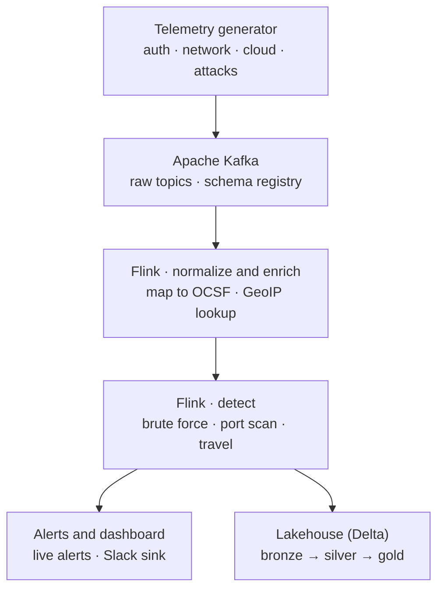

# stream-sentinel

**A real-time XDR detection platform built on Apache Kafka, Apache Flink, and Delta Lake.**

Security telemetry streams in from multiple sources, gets normalized and enriched in
flight, runs through real-time detection logic, and lands in a lakehouse for threat
hunting — all running locally on your laptop with a single command, at zero cost.

Built in public. Follow along as it grows.

---

## What you'll build

Most streaming tutorials move rows between two tables and call it a pipeline. This one
builds the streaming backbone of an **Extended Detection & Response (XDR)** system — the
kind of platform a security team actually runs:

- Ingest high-volume security events (logins, network flows, cloud audit logs)
- Normalize messy multi-source data into one common schema in real time
- Detect threats as they happen — brute-force attacks, port scans, impossible-travel logins
- Land everything in a lakehouse (bronze → silver → gold) for historical hunting
- Fan detections out to a live dashboard and alerting — all with sub-second latency

By the end you have a portfolio project that shows you can design and operate a
production-shaped streaming system, not just a toy.

---

## Architecture



The spine is deliberately simple: **generate → ingest → normalize → detect → serve.**
Detections fan out two ways at once — to a live dashboard and down into the lakehouse.

---

## Tech stack

| Layer            | Local (free)                          | Cloud upgrade (later)                  |
|------------------|---------------------------------------|-----------------------------------------|
| Event streaming  | Kafka-compatible broker (local)       | Azure Event Hubs (Kafka-compatible)     |
| Schema registry  | Local schema registry                 | Azure Schema Registry / Confluent       |
| Stream processing| Apache Flink                          | Apache Flink (same jobs)                |
| Object storage   | MinIO (S3-compatible)                 | Azure Data Lake Storage Gen2            |
| Lakehouse        | Spark + Delta Lake (local)            | Azure Databricks + Delta Lake           |
| Dashboard/alerts | Local dashboard + Slack webhook       | same                                     |
| Infra provisioning | —                                    | Terraform (Azure)                        |

The whole point: **the local and cloud paths run the same processing code.** The Flink
jobs and detection logic don't change between local and cloud — only the storage and
ingestion clients swap out for the cloud phase.
>  **Note:** unlike MinIO, Azure Data Lake Storage Gen2 is not S3-API-compatible, so this
> isn't a drop-in `.env` change — the object storage client itself gets swapped when we
> wire up the cloud upgrade.

---

## Quickstart

Requirements: [Docker Desktop](https://www.docker.com/products/docker-desktop/) and Git.

```bash
git clone https://github.com/RamfisOrtega/stream-sentinel.git
cd stream-sentinel
cp .env.example .env
docker compose up -d
```

That brings up the local backbone — the streaming broker, schema registry, a broker
console, and S3-compatible storage. Then open:

- **Broker console** → http://localhost:8080
- **Storage console** → http://localhost:9001 (login: `minioadmin` / `minioadmin`)

Stop everything with `docker compose down`.

> Processing (Flink jobs), the telemetry generator, and the dashboard get wired in as the
> project grows — follow the roadmap below.

---

## Project structure

```
stream-sentinel/
├── docker-compose.yml   # the local backbone (broker, registry, console, storage)
├── .env.example         # config template — copy to .env
├── generator/           # telemetry simulator + attack scenarios
├── ingestion/           # topics + schemas
│   └── schemas/
├── processing/
│   ├── normalize/       # raw events → common schema + enrichment
│   └── detections/      # the detection jobs
├── lakehouse/           # bronze / silver / gold (Delta)
├── serving/             # dashboard + alert sink
├── infra/               # Terraform on Azure — Event Hubs, ADLS Gen2, Databricks
└── docs/                # architecture notes and diagrams
```

---

## Detections

| Detection            | What it catches                                      | Status   |
|----------------------|------------------------------------------------------|----------|
| Brute force          | Many failed logins per user/IP in a short window     | Planned  |
| Port scan            | One source touching many ports/hosts quickly         | Planned  |
| Impossible travel    | Two logins from geo-distant places, minutes apart    | Planned  |
| Beaconing / C2       | Suspiciously periodic outbound connections           | Planned  |

---

## Roadmap

- [x] Repo scaffold and local backbone
- [ ] Telemetry generator with injectable attack scenarios
- [ ] Kafka ingestion + schemas
- [ ] Flink normalization to a common schema (OCSF-aligned) + GeoIP enrichment
- [ ] First live detection: brute force
- [ ] Delta lakehouse (bronze → silver → gold) + hunting queries
- [ ] Live dashboard + Slack alerting
- [ ] Cloud upgrade path: Azure (Event Hubs, ADLS Gen2, Databricks) via Terraform

---

## License

MIT — see [LICENSE](LICENSE).